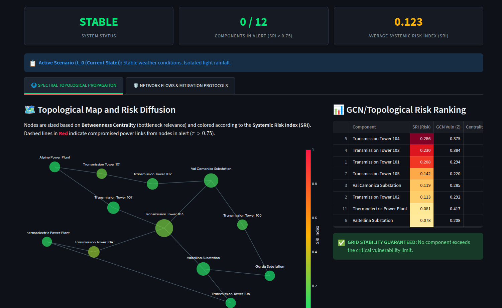
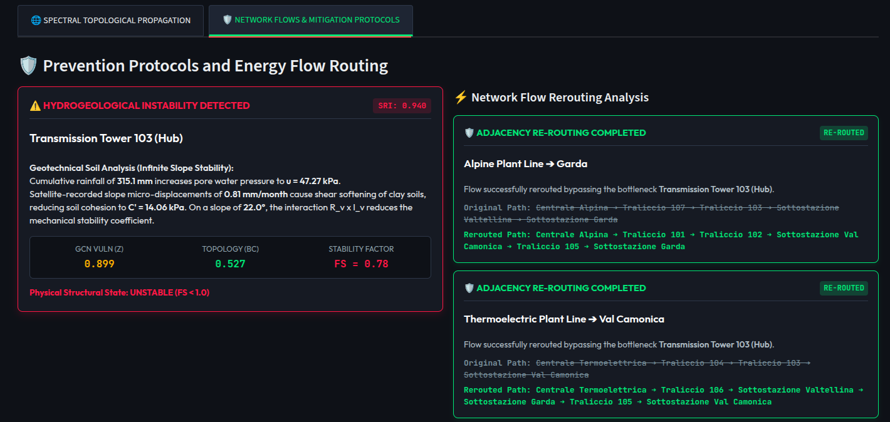

# ⚡ Resilien-T Grid

An advanced, high-fidelity **Digital Twin** and **Physics-Informed Graph Convolutional Network (GCN)** engine designed to monitor, analyze, and predict hydrogeological landslide risks affecting high-voltage National Transmission Grids. Built from scratch using linear algebra in NumPy and topological network models in NetworkX.

---

## 📌 Visual Showcase & Demo
Below is the visual overview of the live operational dashboard monitoring the grid state and computing active mitigation protocols.

### 🖼️ Dashboard Overview & System States

*Figure 1: Live dashboard displaying the topological risk propagation map, global KPI cards, and dynamic risk ranking under extreme weather forcing.*

### 🛡️ Geotechnical Analysis & Real-Time Re-Routing

*Figure 2: Physics-Informed Geotechnical evaluation (Factor of Safety) coupled with automated NetworkX topological shortest-path re-routing during a simulated structural failure.*

---

## 🎯 Core Features & Innovation

1. **Pure Spectral GCN Layer (No-Hallucination AI):** Computes spatial message-passing directly on the power grid's adjacency matrix using a custom symmetry-normalized Laplacian built from scratch with NumPy.
2. **Physics-Informed Risk Fusion:** Integrates deterministic soil mechanics (Infinite Slope Stability Model) into the GCN output, dynamically cross-evaluating cumulative satellite interferometry (`InSAR` ground displacement), slope inclination, and temporal rainfall profiles.
3. **Topological Threat Multiplier:** Couples the predicted local geotechnical vulnerability ($Z$) with the global network topology via **Exact Betweenness Centrality** to compute the final *Systemic Risk Index (SRI)*.
4. **Active Flow Countermeasures (Re-routing):** Simulates structural tower failures and instantly computes alternative energy pathways using NetworkX pathfinding algorithms to prevent regional cascading blackouts.
5. **Bilingual Production Readiness:** Features native runtime localization (Italian / English) and architectural code separation (`app.py`, `styles.py`, `translations.py`).

---

## 🧮 Mathematical Framework

The core engine implements a graph-spectral forward propagation pass over a network topology $G=(V,E)$ consisting of $N=12$ vital infrastructure nodes (Generators, Substations, and Hub Transmission Towers).

### 1. Symmetric Normalized Laplacian Matrix
To perform spatial aggregation without gradient explosion, we compute:
$$\tilde{A} = A + I_N \quad \text{[Self-connected Adjacency]}$$
$$\hat{A} = \tilde{D}^{-1/2} \tilde{A} \tilde{D}^{-1/2} \quad \text{[Symmetric Normalized Laplacian]}$$

### 2. GCN Forward Pass & Activation
Given the normalized raw feature tensor $X \in \mathbb{R}^{N \times 3}$ (Rainfall, InSAR creep, Terrain Slope) and the engineering weight matrix $W$, the layer computes:
$$Z = \sigma\left(\hat{A} X W + b\right)$$

### 3. Geotechnical Constraints (Infinite Slope Model)
The physical Factor of Safety ($FS$) is dynamically evaluated as:
$$FS = \frac{C' + (\sigma_n - u_{pore}) \tan(\phi)}{\sigma_n \tan(\alpha)}$$
*Where pore pressure $u$ scales with rainfall, and cohesion $C'$ softens exponentially with InSAR displacement.*

### 4. Systemic Risk Index (SRI)
The network threat vector blends the GCN hazard state ($Z$) with physical soil degradation, weighted against topological centrality:
$$SRI_i = \left(0.6 \cdot Z_i + 0.4 \cdot \text{Vuln}_{geo, i}\right) \times C_{topo, i}$$

---